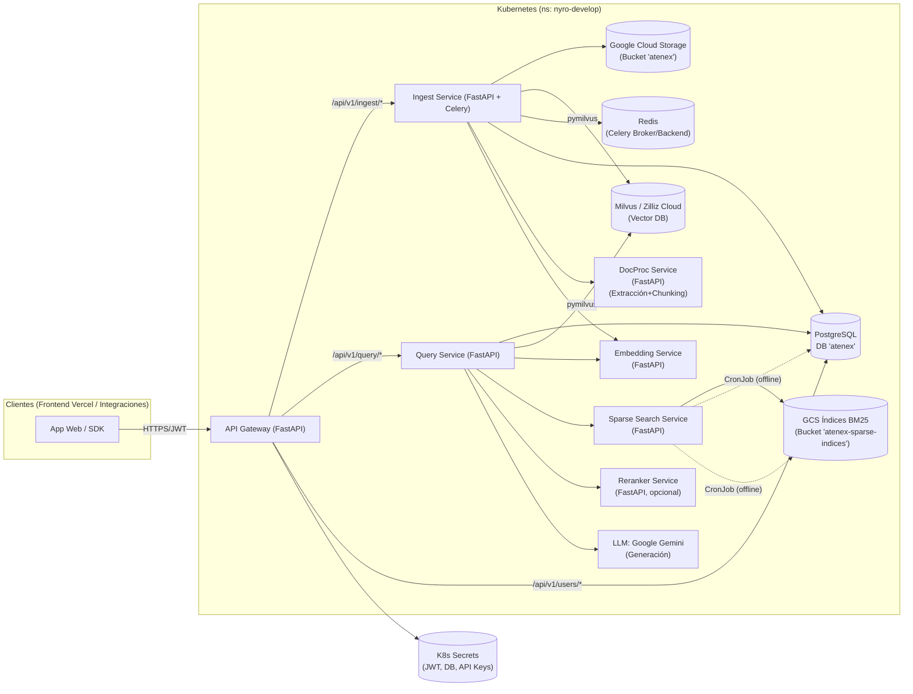

# Atenex – Plataforma RAGaaS

**README maestro del sistema (arquitectura, flujos, DB y despliegue)**

> Este documento unifica y depura la información de todos los microservicios adjuntos (`api-gateway`, `ingest-service`, `query-service`, `embedding-service`, `docproc-service`, `sparse-search-service`, `reranker-service`) y la presenta como una guía **completa y coherente** del sistema **Atenex**.

---

## 1) ¿Qué es Atenex?

**Atenex** es una plataforma **SaaS B2B de RAG (Retrieval-Augmented Generation) como servicio**. Permite a empresas:

* **Ingerir** documentos (PDF/DOCX/TXT/HTML/MD), almacenarlos en GCS y **indexarlos** en una base vectorial (Milvus/Zilliz) y en PostgreSQL (metadatos y chunks).
* **Consultar** en lenguaje natural sobre su **propio corpus** (multi-tenant), combinando recuperación **densa** (vectores) y **dispersa** (BM25), **fusionándolas** y **rerankeando** antes de preguntar a un LLM (Gemini).
* **Operar** mediante un **API Gateway** con **JWT** (login y asociación de compañía) y propagación de contexto (`X-Company-ID`, `X-User-ID`, etc.).

---

## 2) Arquitectura (visión macro)



**Notas importantes:**

* **Almacenamiento de archivos**: **GCS** (MinIO se menciona en docs antiguos y está **deprecado** en la configuración actual).
* **Vector DB**: **Milvus/Zilliz Cloud**.
* **Multi-tenant**: Aislamiento por `company_id` en **todos** los stores (GCS prefix, campos escalares en Milvus, columnas en PostgreSQL).
* **JWT** emitido/validado por el **API Gateway** (login + ensure-company).

---

## 3) Flujos end-to-end

### 3.1 Autenticación y asociación de compañía

1. **Login** `POST /api/v1/users/login` (Gateway)

   * Verifica usuario en **PostgreSQL** (email + `passlib[bcrypt]`),
   * Emite **JWT** (`python-jose`) con `sub`, `email`, `exp` y **`company_id` si existe**.

2. **Ensure Company** `POST /api/v1/users/me/ensure-company` (Gateway)

   * Valida JWT **sin requerir** `company_id`.
   * Determina `company_id` (body > default env > actual) y **actualiza en PostgreSQL**.
   * Devuelve **nuevo JWT** con `company_id`.

3. **Consumo de APIs protegidas** (`/ingest/*`, `/query/*`)

   * **StrictAuth**: requiere JWT **con `company_id`** válido y usuario activo.
   * Propaga `X-Company-ID`, `X-User-ID`, `X-User-Email`, `X-Request-ID`.

---

### 3.2 Ingesta de documentos

1. **Upload** `POST /api/v1/ingest/upload`

   * Headers: `X-Company-ID`, `X-User-ID`.
   * Crea registro en **PostgreSQL** `documents` (estado `pending` → `uploaded`).
   * Sube archivo a **GCS**: `gs://atenex/{company_id}/{document_id}/{filename}`.
   * Encola tarea **Celery** `process_document_standalone` → `202 Accepted`.

2. **Worker Celery (pipeline)**

   * `status` → `processing`.
   * Descarga archivo de **GCS**.
   * Llama **DocProc** → **texto + chunks**.
   * Llama **Embedding** → **vectores** por chunk.
   * **Milvus**: borra chunks anteriores del documento y **inserta** nuevos
     (con `company_id`, `document_id`, `content`, metadatos, `embedding`).
   * **PostgreSQL** `document_chunks`: inserción masiva de chunks (contenido + metadatos + `embedding_id`).
   * `status` → `processed` (o `error` con `error_message`).

3. **Estado / Retry / Delete**

   * `GET /api/v1/ingest/status/{document_id}` y `GET /status`
   * `POST /api/v1/ingest/retry/{document_id}` (si `error`)
   * `DELETE /api/v1/ingest/{document_id}` (borra en **PSQL**, **GCS**, **Milvus**).

---

### 3.3 Consulta (RAG) + Chat

1. **`POST /api/v1/query/ask`**

   * Gestiona chat (crea o continúa), guarda mensaje de usuario (PSQL `messages`).
   * Detecta **saludo** simple → responde directo (sin RAG).

2. **Si no es saludo: pipeline RAG**

   * **Embed de la consulta** (→ `Embedding Service`).
   * **Recuperación híbrida**:

     * **Densa** en **Milvus** (filtrando por `company_id`).
     * **Dispersa** (opcional) → `Sparse Search Service` (BM25 precalculado por compañía).
   * **Fusión RRF** (denso + disperso).
   * Recupera **contenido** de chunks faltantes desde **PostgreSQL**.
   * **Reranking** opcional → `Reranker Service`.
   * **Filtro diversidad** opcional (MMR).
   * **MapReduce** opcional (si superan umbral de chunks):

     * *Map*: extrae info por lotes con LLM
     * *Reduce*: sintetiza respuesta final con LLM.
   * **Direct RAG** (si no hay MapReduce): construye prompt con plantillas.
   * **Generación** → **Gemini** (respuesta JSON estructurada).

3. **Persistencia de resultados**

   * Guarda mensaje del asistente (respuesta + fuentes) en `messages`.
   * Log de interacción en `query_logs` (pipeline, métricas, ids).
   * Respuesta al cliente.

---

### 3.4 Índices dispersos BM25 (offline)

* **CronJob** periódico construye índices BM25 **por compañía**:

  * Lee contenidos de `document_chunks` (sólo documentos `processed`).
  * Construye índice con `bm2s`, serializa + `id_map`.
  * Sube a **GCS** `gs://atenex-sparse-indices/indices/{company_id}/`.
* **`Sparse Search Service`** en runtime:

  * Carga índice desde **cache LRU/TTL** o descarga de **GCS** y cachea.
  * Responde `POST /api/v1/search` con `{chunk_id, score}`.

---

## 4) Microservicios (resumen operacional)

### 4.1 API Gateway

* **Rol**: entrada única, **JWT** (login/ensure-company), **proxy** a `/ingest/*` y `/query/*`, inyección de headers, CORS, health.
* **Tecnología**: FastAPI, httpx, asyncpg, python-jose, passlib, structlog.
* **Endpoints clave**:

  * `POST /api/v1/users/login`
  * `POST /api/v1/users/me/ensure-company`
  * `/* /api/v1/ingest/...` (proxy con `StrictAuth`)
  * `/* /api/v1/query/...` (proxy con `StrictAuth`)
* **Notas**: Requiere `GATEWAY_JWT_SECRET`, acceso a PostgreSQL.

  * **Propaga** `X-Company-ID`, `X-User-ID`, `X-User-Email`, `X-Request-ID`.

### 4.2 Ingest Service (v0.3.2)

* **Rol**: subir, orquestar, procesar y **indexar** documentos (GCS+Milvus+PSQL).
* **Tecnología**: FastAPI, Celery/Redis, Pymilvus, google-cloud-storage, SQLAlchemy (worker), asyncpg (API).
* **Endpoints**: `/api/v1/ingest/upload`, `/status/{id}`, `/status`, `/retry/{id}`, `DELETE /{id}`, `DELETE /bulk`.
* **Pipeline**: DocProc → Embedding → Milvus (insert) → PostgreSQL (chunks).
* **Multi-tenant**: `company_id` en **GCS prefix**, **PSQL** y **Milvus** (campo escalar).

### 4.3 Query Service (v0.3.3)

* **Rol**: chats y pipeline **RAG** híbrido + LLM (Gemini).
* **Tecnología**: FastAPI, asyncpg, pymilvus, httpx, haystack-ai (PromptBuilder), google-generativeai.
* **Endpoints**: `/api/v1/query/ask`, `/chats`, `/chats/{id}/messages`, `DELETE /chats/{id}`, `/health`.
* **RAG**: denso (Milvus) + disperso (Sparse) + RRF + (Reranker) + (MMR) + (MapReduce) + Gemini.

### 4.4 Embedding Service (v1.1.1)

* **Rol**: generar **embeddings** (OpenAI `text-embedding-3-small` por defecto).
* **Tecnología**: FastAPI, `openai`, Tenacity, structlog.
* **Endpoint**: `POST /api/v1/embed`.
* **Dimensión por defecto**: **1536** (modelo por defecto). *(Ver §7.4 sobre alineación de dimensiones).*

### 4.5 DocProc Service (v0.1.0)

* **Rol**: **extraer texto** (PDF/DOCX/TXT/HTML/MD) y **chunkear**.
* **Tecnología**: FastAPI, PyMuPDF, python-docx, BeautifulSoup, html2text, markdown.
* **Endpoint**: `POST /api/v1/process`.

### 4.6 Sparse Search Service (v1.0.0)

* **Rol**: búsqueda **BM25** por compañía con índices **offline** (CronJob).
* **Tecnología**: FastAPI, `bm2s`, cachetools (TTLCache), google-cloud-storage, asyncpg.
* **Endpoint**: `POST /api/v1/search`.
* **Persistencia de índices**: **GCS** (`atenex-sparse-indices`).

### 4.7 Reranker Service (v0.1.1)

* **Rol**: reordenar chunks con **Cross-Encoder** (`BAAI/bge-reranker-base`).
* **Tecnología**: FastAPI, sentence-transformers (PyTorch), **GPU opcional** (FP16, 1 worker).
* **Endpoint**: `POST /api/v1/rerank`.

---

## 5) Datos y almacenamiento

### 5.1 PostgreSQL (esquema unificado)

> Lo siguiente consolida **campos explícitos** de los READMEs y añade **sugerencias mínimas** (“recomendados”) para operatividad. Ajusta nombres/índices según tus migraciones reales.

```mermaid
erDiagram
  COMPANIES ||--o{ USERS : "1:N"
  COMPANIES ||--o{ DOCUMENTS : "1:N"
  COMPANIES ||--o{ CHATS : "1:N"

  USERS ||--o{ CHATS : "1:N"
  CHATS ||--o{ MESSAGES : "1:N"
  DOCUMENTS ||--o{ DOCUMENT_CHUNKS : "1:N"

  COMPANIES {
    uuid id PK
    text name
    text slug
    boolean is_active
    timestamptz created_at
    timestamptz updated_at
  }

  USERS {
    uuid id PK
    text email UK
    text password_hash
    uuid company_id FK -> COMPANIES.id NULL
    boolean is_active
    timestamptz created_at
    timestamptz updated_at
    timestamptz last_login_at
  }

  DOCUMENTS {
    uuid id PK
    uuid company_id FK -> COMPANIES.id
    text file_name
    text file_type
    text file_path
    jsonb metadata
    text status  // pending|uploaded|processing|processed|error
    integer chunk_count
    text error_message
    timestamptz uploaded_at
    timestamptz updated_at
  }

  DOCUMENT_CHUNKS {
    uuid id PK
    uuid document_id FK -> DOCUMENTS.id ON DELETE CASCADE
    uuid company_id
    integer chunk_index
    text content
    jsonb metadata  // page, title, tokens, content_hash, ...
    text embedding_id // PK del chunk en Milvus
    text vector_status // created / ...
    timestamptz created_at
  }

  CHATS {
    uuid id PK
    uuid company_id FK -> COMPANIES.id
    uuid user_id FK -> USERS.id
    text title
    timestamptz created_at
    timestamptz updated_at
    boolean is_archived
  }

  MESSAGES {
    uuid id PK
    uuid chat_id FK -> CHATS.id ON DELETE CASCADE
    text role // user|assistant|system
    text content
    jsonb sources  // fuentes citadas, ids de chunks, etc.
    timestamptz created_at
  }

  QUERY_LOGS {
    uuid id PK
    uuid company_id
    uuid user_id
    uuid chat_id
    text question
    text answer
    jsonb pipeline // métricas, topK, flags (bm25, reranker, mapreduce), scores, ids
    timestamptz created_at
  }
```

**Índices recomendados (resumen):**

* `users(email)` **UNIQUE**; `users(company_id)`; `users(is_active)`.
* `documents(company_id, status)`; **UNIQUE parcial** `(company_id, file_name) WHERE status <> 'error'` (evita duplicados de nombre).
* `document_chunks(document_id)`, `document_chunks(company_id)`, **GIN** en `document_chunks(metadata)`.
* `chats(company_id, user_id)`; `messages(chat_id, created_at)`.
* `query_logs(company_id, created_at)`, **GIN** en `query_logs(pipeline)`.

> **Observación**: Los READMEs citan explícitamente `documents` y `document_chunks` (y en `query-service` el manejo de chats, mensajes y logs). `users`/`companies` se deducen del **Gateway** (login y association).

---

### 5.2 Milvus / Zilliz (colección de chunks)

> El **worker de ingesta** inserta entidades de chunks con vectores y metadatos. Asegura **coherencia** con la dimensión del embedding (§7.4).

**Campos típicos de la colección (servidorless Zilliz/AutoIndex o índice definido):**

* `pk_id` (**VARCHAR**, PK) → `"{document_id}_{chunk_index}"` (o `embedding_id`)
* `embedding` (**FLOAT\_VECTOR**, dimensión **coherente**)
* `content` (**VARCHAR**, truncado si excede límite)
* `company_id` (**VARCHAR**) — **filtro multi-tenant**
* `document_id` (**VARCHAR**)
* `file_name` (**VARCHAR**)
* `page` (**INT64**, opcional)
* `title` (**VARCHAR**, opcional)
* `tokens` (**INT64**, opcional)
* `content_hash` (**VARCHAR**, opcional)

**Índices/optimizaciones:**

* Índices escalares en `company_id` y `document_id` para filtros.
* Índice vectorial (AutoIndex/HNSW/IVF\* según el plan de Zilliz).
* **Expr** de consulta siempre con `company_id == "<uuid>"`.

---

### 5.3 Google Cloud Storage (archivos + índices BM25)

* **Archivos de usuario**: `gs://atenex/{company_id}/{document_id}/{filename}`
* **Índices BM25 (Sparse)**:
  `gs://atenex-sparse-indices/indices/{company_id}/bm25_index.bm2s`
  `gs://atenex-sparse-indices/indices/{company_id}/id_map.json`

---

## 6) Seguridad y multi-tenant

* **JWT**: firma con `HS256` (**`GATEWAY_JWT_SECRET`**), expiración `exp`, `sub` (user id), `email`, `company_id` (obligatorio tras **ensure-company**).
* **Validaciones**:

  * **StrictAuth**: requiere `company_id` en JWT y usuario **activo** en PSQL.
  * En ingest/query, el **Gateway** inyecta headers de contexto; los servicios **deben usarlos** para filtrar/aislar datos.
* **Secrets** en K8s (Namespace `nyro-develop`):

  * Gateway: `GATEWAY_JWT_SECRET`, `GATEWAY_POSTGRES_PASSWORD`.
  * Query: `QUERY_POSTGRES_PASSWORD`, `QUERY_GEMINI_API_KEY`, `QUERY_ZILLIZ_API_KEY`.
  * Embedding: `EMBEDDING_OPENAI_API_KEY`.
  * Sparse: `SPARSE_POSTGRES_PASSWORD` (+ credenciales GCP si aplica).
  * Reranker: (no DB; posible HF cache; GPU opcional).
* **GCS**: acceso por **Workload Identity** o **keys** montadas en Pod.

---

## 7) Configuración crítica (matriz resumida)

> Revisa los README de cada servicio para el detalle completo. Aquí listamos **claves críticas** que deben estar alineadas.

### 7.1 API Gateway

* **DB**: `GATEWAY_POSTGRES_*`
* **JWT**: `GATEWAY_JWT_SECRET`, `GATEWAY_JWT_ALGORITHM=HS256`
* **Rutas**: `GATEWAY_INGEST_SERVICE_URL`, `GATEWAY_QUERY_SERVICE_URL`
* **Default tenant**: `GATEWAY_DEFAULT_COMPANY_ID` (opcional)
* **CORS**: `VERCEL_FRONTEND_URL`

### 7.2 Ingest Service

* **DB**: `POSTGRES_*`
* **GCS**: `GCS_BUCKET_NAME` (+ credenciales)
* **Milvus/Zilliz**: `MILVUS_URI`, `ZILLIZ_API_KEY`, `MILVUS_COLLECTION_NAME`, **`EMBEDDING_DIMENSION`**
* **Celery/Redis**: `CELERY_BROKER_URL`, `CELERY_RESULT_BACKEND`
* **Servicios**: `INGEST_DOCPROC_SERVICE_URL`, `INGEST_EMBEDDING_SERVICE_URL`

### 7.3 Query Service

* **DB**: `QUERY_POSTGRES_*` (+ `QUERY_POSTGRES_PASSWORD`)
* **Milvus/Zilliz**: `QUERY_EMBEDDING_DIMENSION`, `ZILLIZ_API_KEY`, colección/URI
* **Embedding**: `QUERY_EMBEDDING_SERVICE_URL`
* **Sparse (opcional)**: `QUERY_BM25_ENABLED`, `QUERY_SPARSE_SEARCH_SERVICE_URL`
* **Reranker (opcional)**: `QUERY_RERANKER_ENABLED`, `QUERY_RERANKER_SERVICE_URL`
* **LLM**: `QUERY_GEMINI_API_KEY`
* **Parámetros RAG**: `QUERY_RETRIEVER_TOP_K`, `QUERY_MAX_CONTEXT_CHUNKS`, `QUERY_MAPREDUCE_*`, `QUERY_DIVERSITY_*`

### 7.4 Embedding Service

* **OpenAI**: `EMBEDDING_OPENAI_API_KEY`, `EMBEDDING_OPENAI_EMBEDDING_MODEL_NAME` *(por defecto `text-embedding-3-small`, **1536**)*, `EMBEDDING_EMBEDDING_DIMENSION`

> 🔴 **Alineación de dimensión**: La dimensión del embedding **debe** coincidir en **Embedding Service**, **Ingest Service** (para Milvus) y **Query Service**.
> Los READMEs muestran `1536` (OpenAI `text-embedding-3-small`) y también `384` en ejemplos históricos. **Elige 1** y **ajusta todas** las variables pertinentes y la colección de Milvus. Si cambias el tamaño:
>
> * Reindexa en Milvus (y considera reingestar).
> * Actualiza `EMBEDDING_DIMENSION`/`QUERY_EMBEDDING_DIMENSION`.
> * Verifica plantillas y límites de contexto.

### 7.5 DocProc Service

* **Chunking**: `DOCPROC_CHUNK_SIZE`, `DOCPROC_CHUNK_OVERLAP`
* **Soportados**: `DOCPROC_SUPPORTED_CONTENT_TYPES`

### 7.6 Sparse Search Service

* **DB**: `SPARSE_POSTGRES_*`
* **GCS índices**: `SPARSE_INDEX_GCS_BUCKET_NAME`
* **Cache**: `SPARSE_INDEX_CACHE_MAX_ITEMS`, `SPARSE_INDEX_CACHE_TTL_SECONDS`
* **CronJob**: usa las mismas credenciales/roles y recursos ajustados a volumen.

### 7.7 Reranker Service

* **Modelo**: `RERANKER_MODEL_NAME=BAAI/bge-reranker-base`
* **Dispositivo**: `RERANKER_MODEL_DEVICE=cpu|cuda`
  (si `cuda` → fuerza `WORKERS=1` y `TOKENIZER_WORKERS=0`; FP16).

---

## 8) Operación y despliegue

### 8.1 Local (desarrollo)

* Cada servicio tiene su `.env` y `poetry run uvicorn ... --reload`.
* Requiere **PostgreSQL** local con DB `atenex` y tablas disponibles.
* Para ingest: **GCS** (o emular con variables apropiadas).
* Para query: **Milvus/Zilliz** y **Gemini API key** válidos.
* Para embeddings: **OpenAI API key**.

### 8.2 Docker/Kubernetes

* **Imagen por servicio**, push a tu registro (p. ej., `ghcr.io`).
* **Namespace**: `nyro-develop`.

  * **ConfigMaps** con valores no sensibles.
  * **Secrets** con claves/API keys/contraseñas.
* Despliegue `Deployment` + `Service` para cada microservicio.
* **CronJob** de `sparse-search-service` para índices BM25.
* **Liveness/Readiness**: `GET /health` (todos los servicios lo exponen).

### 8.3 CI/CD

* Pipelines por directorio detectan cambios, **build/push** imagen, y **actualizan manifests** (si usas GitOps/ArgoCD).
* Para **reranker GPU externo**, el pipeline imprime comandos `docker run` para actualización manual (si no corre en K8s).

---

## 9) Observabilidad, resiliencia y rendimiento

* **Logging**: `structlog` JSON en todos los servicios.
* **Correlación**: `X-Request-ID` desde Gateway hasta downstream.
* **Health**: `GET /health` verifica modelo/cliente (Embedding, Reranker, Sparse, etc.).
* **Reintentos**: `tenacity` (Embedding), reintentos HTTP configurables en clientes de `ingest` y `query`.
* **Celery (ingest)**: desacopla cargas pesadas y proporciona **retry** controlado (a nivel de app).
* **BM25 offline**: dramática reducción de latencia en búsqueda dispersa.
* **GPU** (Reranker): FP16, 1 worker, tokenización secuencial para estabilidad.
* **Escalado**: replicas por servicio; dimensiona **Redis**, **PSQL** y **Memoria** de `Sparse` (por tamaño de índices cacheados).

---

## 10) Endpoints públicos principales (vistas de conjunto)

* **Gateway**

  * `POST /api/v1/users/login`
  * `POST /api/v1/users/me/ensure-company`
  * Proxy: `/api/v1/ingest/*`, `/api/v1/query/*`
* **Ingest**

  * `POST /api/v1/ingest/upload`
  * `GET /api/v1/ingest/status/{document_id}`
  * `GET /api/v1/ingest/status`
  * `POST /api/v1/ingest/retry/{document_id}`
  * `DELETE /api/v1/ingest/{document_id}`, `DELETE /api/v1/ingest/bulk`
* **Query**

  * `POST /api/v1/query/ask`
  * `GET /api/v1/query/chats`, `GET /api/v1/query/chats/{id}/messages`, `DELETE /api/v1/query/chats/{id}`
* **Embedding**

  * `POST /api/v1/embed`
* **DocProc**

  * `POST /api/v1/process`
* **Sparse**

  * `POST /api/v1/search`
* **Reranker**

  * `POST /api/v1/rerank`

> Todos exponen `GET /health` para probes.

---

## 11) Consideraciones y compatibilidad

* **MinIO vs GCS**: El diseño actual usa **GCS**; si vienes de MinIO, actualiza clientes/variables/roles.
* **Dimensiones de embedding**: homologa **una sola** dimensión en **Embeddings/Ingester/Query/Milvus**. Cambios requieren **reindexado**.
* **Garantías de consistencia**:

  * Ingest **borra-inserta** chunks del documento en Milvus.
  * Endpoints de **status** comparan PSQL vs Milvus vs GCS.
* **Seguridad**: No expongas secrets ni llaves en repos. Usa **K8s Secrets** (o Workload Identity).
* **Tenancy**: **Nunca** olvides filtrar por `company_id` en Milvus/BM25 y columnas de PSQL.

---

## 12) Anexos: DDL base sugerido (PSQL)

> Ajusta tipos, defaults y constraints a tus migraciones reales.

```sql
-- COMPANIES
CREATE TABLE companies (
  id uuid PRIMARY KEY,
  name text NOT NULL,
  slug text UNIQUE,
  is_active boolean NOT NULL DEFAULT true,
  created_at timestamptz NOT NULL DEFAULT now(),
  updated_at timestamptz NOT NULL DEFAULT now()
);

-- USERS
CREATE TABLE users (
  id uuid PRIMARY KEY,
  email text NOT NULL UNIQUE,
  password_hash text NOT NULL,
  company_id uuid REFERENCES companies(id),
  is_active boolean NOT NULL DEFAULT true,
  created_at timestamptz NOT NULL DEFAULT now(),
  updated_at timestamptz NOT NULL DEFAULT now(),
  last_login_at timestamptz
);

-- DOCUMENTS
CREATE TABLE documents (
  id uuid PRIMARY KEY,
  company_id uuid NOT NULL REFERENCES companies(id),
  file_name text NOT NULL,
  file_type text NOT NULL,
  file_path text NOT NULL,
  metadata jsonb,
  status text NOT NULL CHECK (status IN ('pending','uploaded','processing','processed','error')),
  chunk_count integer NOT NULL DEFAULT 0,
  error_message text,
  uploaded_at timestamptz NOT NULL DEFAULT now(),
  updated_at timestamptz NOT NULL DEFAULT now()
);

CREATE UNIQUE INDEX ux_documents_company_filename_active
ON documents (company_id, file_name)
WHERE status <> 'error';

-- DOCUMENT_CHUNKS
CREATE TABLE document_chunks (
  id uuid PRIMARY KEY,
  document_id uuid NOT NULL REFERENCES documents(id) ON DELETE CASCADE,
  company_id uuid NOT NULL,
  chunk_index integer NOT NULL,
  content text NOT NULL,
  metadata jsonb,
  embedding_id text NOT NULL,     -- pk en Milvus/Zilliz
  vector_status text NOT NULL,    -- 'created', ...
  created_at timestamptz NOT NULL DEFAULT now()
);

CREATE INDEX ix_document_chunks_document_id ON document_chunks(document_id);
CREATE INDEX ix_document_chunks_company_id ON document_chunks(company_id);
CREATE INDEX ix_document_chunks_metadata ON document_chunks USING GIN (metadata);

-- CHATS
CREATE TABLE chats (
  id uuid PRIMARY KEY,
  company_id uuid NOT NULL REFERENCES companies(id),
  user_id uuid NOT NULL REFERENCES users(id),
  title text,
  is_archived boolean NOT NULL DEFAULT false,
  created_at timestamptz NOT NULL DEFAULT now(),
  updated_at timestamptz NOT NULL DEFAULT now()
);

-- MESSAGES
CREATE TABLE messages (
  id uuid PRIMARY KEY,
  chat_id uuid NOT NULL REFERENCES chats(id) ON DELETE CASCADE,
  role text NOT NULL CHECK (role IN ('user','assistant','system')),
  content text NOT NULL,
  sources jsonb,
  created_at timestamptz NOT NULL DEFAULT now()
);

CREATE INDEX ix_messages_chat_created ON messages(chat_id, created_at);

-- QUERY_LOGS
CREATE TABLE query_logs (
  id uuid PRIMARY KEY,
  company_id uuid NOT NULL,
  user_id uuid NOT NULL,
  chat_id uuid,
  question text NOT NULL,
  answer text,
  pipeline jsonb,
  created_at timestamptz NOT NULL DEFAULT now()
);

CREATE INDEX ix_query_logs_company_created ON query_logs(company_id, created_at);
CREATE INDEX ix_query_logs_pipeline ON query_logs USING GIN (pipeline);
```

---

## 13) Roadmap / TODO

* Rate limiting en Gateway.
* OpenTelemetry (tracing distribuido end-to-end).
* Caching selectivo (config/datos poco cambiantes).
* Renovación/refresco de tokens JWT.
* Tests de integración e2e (login → ingest → query → logs).
* Invalidación selectiva de caché BM25 tras reconstrucciones urgentes.
* Estrategia de **re-embed**/reindex tras cambios de modelo/dimensión.
* Validación estricta de `company_id` y políticas de pertenencia (invitaciones/domino email).

---

## 14) Glosario rápido

* **RAG**: Recuperar pasajes relevantes y pasárselos al **LLM** para respuestas con contexto.
* **Denso**: similitud por **vectores** (Milvus/Zilliz).
* **Disperso**: similitud por **palabras clave** (BM25).
* **RRF**: **Reciprocal Rank Fusion** (combina listas denso+disperso).
* **MMR**: **Maximal Marginal Relevance** (diversidad).
* **MapReduce**: 2 pasos con LLM para corpus grande (extraer → sintetizar).

---

### Créditos de versiones (según READMEs)

* **Embedding Service** v1.1.1
* **Ingest Service** v0.3.2
* **Query Service** v0.3.3
* **Reranker Service** v0.1.1
* **DocProc Service** v0.1.0
* **Sparse Search Service** v1.0.0