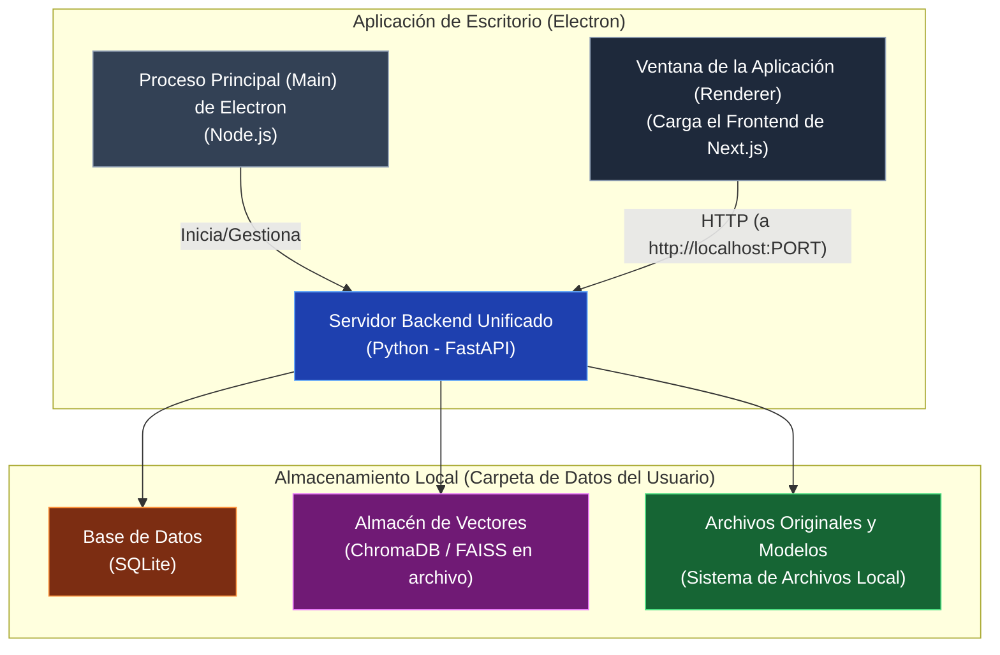

## Plan de Transformación: Atenex SaaS a Aplicación de Escritorio Offline

### **Visión General y Principios Guía**

El objetivo es convertir Atenex en un RAG (Retrieval-Augmented Generation) personal y offline. Esto implica cambiar radicalmente los principios de diseño:

1.  **De Distribuido a Monolítico:** La arquitectura de microservicios, ideal para la escalabilidad en la nube, es una sobrecarga innecesaria para una aplicación local. Fusionaremos la lógica del backend en una única aplicación.
2.  **De Cloud a Local:** Reemplazaremos todas las dependencias de la nube (GCS, Gemini, Zilliz Cloud) por alternativas locales, ligeras y basadas en archivos.
3.  **Multi-tenant local (mantener y adaptar):** Conservaremos la capacidad multi-tenant (campos `company_id` y `user_id`) pero adaptada al modo offline. La aplicación podrá gestionar múltiples "tenants" locales (perfiles o empresas) en la misma instalación, aislando los datos por tenant mediante columnas en SQLite, prefijos/carpetas en el sistema de archivos y metadatos en el almacén vectorial.
4.  **De Autenticación JWT a Estado Persistente:** Reemplazaremos el complejo flujo de JWT por un mecanismo simple de "iniciar sesión una vez" que persiste el estado localmente.
5.  **De Despliegue en K8s a Instalador de Escritorio:** Empaquetaremos el frontend y el backend en un único ejecutable instalable para Linux y Windows.

### **Fase 1: Nueva Arquitectura y Stack Tecnológico Propuesto**

El cambio más importante es consolidar el backend y empaquetarlo con el frontend. La mejor herramienta para esto es **Electron**.

#### **Arquitectura Propuesta con Electron**

**Flujo de la Nueva Arquitectura:**

1.  **Instalación:** El usuario instala un paquete (`.deb`, `.exe`, etc.).
2.  **Ejecución:** Al lanzar la aplicación, el proceso principal de Electron se inicia.
3.  **Arranque del Backend:** El proceso de Electron inicia el servidor backend unificado de Python (FastAPI) como un proceso hijo, escuchando en un puerto local (`localhost`).
4.  **Arranque del Frontend:** El proceso de Electron crea una ventana que carga la interfaz de Next.js (exportada como un sitio estático).
5.  **Comunicación:** El frontend (ahora local) realiza llamadas `fetch` a `http://localhost:PORT_BACKEND`, comunicándose con el servidor Python local.

#### **Reemplazo del Stack Tecnológico**

| Componente Original (SaaS) | Alternativa Propuesta (Local/Offline) | Justificación |
| :--- | :--- | :--- |
| **Computación/Orquestación** | | |
| Kubernetes, Docker, Gunicorn | **Electron + Proceso Hijo (Python)** | Simplifica radicalmente. Empaqueta todo en un solo ejecutable. |
| **Backend (Microservicios)** | | |
| API Gateway (FastAPI) | Módulo `main.py` en el **Servidor Unificado (FastAPI)** | La autenticación y el enrutamiento se simplifican enormemente. |
| Ingest/Query/DocProc Services | Módulos/Routers en el **Servidor Unificado (FastAPI)** | Se consolida toda la lógica de negocio en una sola base de código Python. |
| **Bases de Datos** | | |
| PostgreSQL (multi-tenant) | **SQLite (soporte multi-tenant)** | Cero configuración, basado en archivos; se conservará soporte multi-tenant local (columnas `company_id`, prefijos de carpeta y metadatos) para permitir varios perfiles/empresas en la misma instalación. |
| Milvus / Zilliz Cloud (Vector DB) | **ChromaDB o FAISS** | Bases de datos vectoriales "en-proceso" que pueden persistir en el disco local. |
| **Almacenamiento y Cola** | | |
| Google Cloud Storage (GCS) | **Sistema de Archivos Local** | Los archivos y los índices se almacenan en una carpeta de datos del usuario. |
| Redis + Celery (Tareas Async) | **Llamadas síncronas o `asyncio.Task`** | Para un solo usuario, la ingesta puede ser un proceso bloqueante (con feedback en la UI) o una tarea en segundo plano simple, eliminando la necesidad de un broker. |
| **Modelos de IA (Crítico)** | | |
| Google Gemini / OpenAI (LLM) | **LLM Local (ej. Llama.cpp, Ollama, CTransformers)** | El núcleo del modo offline. Se usan modelos cuantizados (GGUF) que corren en CPU/GPU local. |
| OpenAI (Embeddings) | **Modelos de Embeddings locales (ej. `sentence-transformers`)** | Modelos eficientes que se pueden ejecutar localmente para crear los vectores. |
| BAAI Cross-Encoder (Reranker) | **Se mantiene (`sentence-transformers`)** | Ya es un modelo local, por lo que su integración es directa. |

---

### **Fase 2: Plan de Refactorización del Backend (Python)**

El objetivo es crear un único servidor FastAPI que contenga toda la lógica.

1.  **Crear un Nuevo Proyecto Python:**
    *   Iniciar un nuevo proyecto con Poetry.
    *   Añadir las dependencias clave: `fastapi`, `uvicorn`, `sqlalchemy` (para SQLite), `chromadb-client` o `faiss-cpu`, `sentence-transformers`, `ctransformers`, y las librerías de parseo de documentos (`PyMuPDF`, `python-docx`, etc.).

2.  **Fusionar los Servicios FastAPI:**
    *   **`api-gateway`:** Su lógica se disuelve. El nuevo `main.py` de FastAPI se convierte en el punto de entrada.
    *   **`docproc-service`:** Convertir su lógica de extracción y chunking en un módulo `processing.py`.
    *   **`embedding-service`, `reranker-service`:** Convertir sus adaptadores de modelos en clases que se cargan al inicio de la aplicación.
    *   **`ingest-service`, `query-service`:** Sus endpoints se convierten en `APIRouter`s dentro de la aplicación principal.

3.  **Adaptar el Pipeline de Ingesta:**
    *   Reescribir el endpoint `POST /api/v1/ingest/upload`.
    *   **Eliminar Celery/Redis:** La llamada se vuelve síncrona o usa un `BackgroundTasks` de FastAPI.
        1.  Recibe el archivo.
        2.  Guarda el archivo en una carpeta local (`app_data/files/{document_id}`).
        3.  Crea el registro en la tabla `documents` de **SQLite**.
        4.  Llama directamente a las funciones del módulo `processing.py` para extraer texto y chunks.
        5.  Llama a la clase del modelo de embedding local para generar vectores para cada chunk.
        6.  Inserta los chunks y sus vectores en **ChromaDB** o el índice **FAISS**.
        7.  Actualiza las tablas `documents` y `document_chunks` en **SQLite**.
        8.  La UI puede mostrar un spinner durante este proceso y recibir la respuesta cuando termine.

4.  **Adaptar el Pipeline de Consulta (RAG):**
    *   Reescribir el endpoint `POST /api/v1/query/ask`.
    *   **Mantener `company_id`:** Conservar y adaptar los filtros por `company_id`. En el modo offline se aislarán los datos por tenant usando la columna `company_id` en SQLite, metadatos en ChromaDB/FAISS y rutas/prefijos en el sistema de archivos.
    *   Llama al modelo de embedding local para vectorizar la consulta.
    *   Realiza la búsqueda de similitud directamente en **ChromaDB/FAISS**.
    *   El `sparse-search-service` se puede integrar como una función que usa `rank_bm25` sobre los datos de SQLite, pero para simplificar, se puede omitir inicialmente y centrarse en la búsqueda densa.
    *   Llama a la clase del modelo de reranker local.
    *   Construye el prompt final.
    *   **Llama al LLM local** a través de la librería seleccionada (`ctransformers` para modelos GGUF es una excelente opción por su compatibilidad con CPU).
    *   Persiste el historial en **SQLite**.

5.  **Simplificar la Base de Datos (SQLite):**
    *   Usar SQLAlchemy con el dialecto de SQLite.
    *   Mantener las tablas `companies` y `query_logs` adaptadas a SQLite local (posible simplificación de columnas y indices, pero conservando la separación por tenant).
    *   Simplificar la tabla `users` si procede, pero conservar relaciones que permitan identificar `user_id` por tenant y registrar actividad por usuario local.
    *   Conservar la columna `company_id` en las tablas críticas para permitir multi-tenant local; documentar el esquema y las migraciones necesarias para adaptar las restricciones a SQLite.

### **Fase 3: Plan de Adaptación del Frontend (Next.js)**

El frontend necesita cambios menores en la lógica pero un cambio fundamental en cómo se empaqueta.

1.  **Exportación Estática:**
    *   Configurar `next.config.mjs` para una exportación estática (`output: 'export'`). Esto genera archivos HTML/CSS/JS puros que Electron puede cargar directamente.

2.  **Adaptar el Cliente API (`lib/api.ts`):**
    *   Modificar la función `getApiGatewayUrl()` para que siempre devuelva `http://localhost:PORT_DEL_BACKEND`, donde el puerto es uno fijo que usará el servidor Python local.
    *   Mantener el envío de cabeceras `X-Company-ID` y `X-User-ID` (o su equivalente local) para que el frontend pueda seleccionar el tenant activo; estas cabeceras se derivarán del perfil/tenant seleccionado por el usuario en la UI.

3.  **Refactorizar la Autenticación (`lib/hooks/useAuth.tsx`):**
    *   Crear un nuevo cliente API para un endpoint local de autenticación simple, por ejemplo `POST /api/v1/setup`.
    *   **Flujo de Primera Vez:**
        1.  El hook `useAuth` comprueba si existe un "estado de login" local (ej. en `localStorage`).
        2.  Si no existe, redirige al usuario a la página de `/login`.
        3.  El usuario introduce sus credenciales (pueden ser decorativas o para crear una clave de encriptación local).
        4.  Se envía al endpoint `/api/v1/setup` del backend.
        5.  El backend crea la base de datos SQLite y guarda un estado "configurado".
        6.  Al recibir una respuesta exitosa, el frontend guarda el estado de "logueado" en `localStorage` y redirige a la aplicación principal (`/chat`).
    *   **Flujos Posteriores:**
        1.  Al iniciar, el hook `useAuth` ve el estado en `localStorage` y permite el acceso directo a la aplicación sin pasar por el login.

4.  **Limpieza de la Interfaz:**
    *   Mantener y adaptar los elementos de la UI relacionados con la gestión de múltiples compañías/perfiles locales: selector de tenant, administración de datos por tenant y export/import de corpora.
    *   El panel de administración se puede reconvertir en un panel de "Configuración Avanzada" para gestionar los modelos locales, la ruta de la base de datos y opciones de tenant (crear, renombrar, exportar). 

---

### **Fase 4: Empaquetado con Electron y Distribución**

1.  **Configurar el Proyecto Electron:**
    *   Añadir Electron como dependencia de desarrollo al proyecto del frontend.
    *   Crear el archivo de entrada del proceso principal de Electron (`main.js` o `electron.cjs`).
    *   En este archivo:
        *   Importar los módulos necesarios (`app`, `BrowserWindow`, `spawn` de `child_process`).
        *   Implementar la lógica para encontrar y ejecutar el servidor Python empaquetado.
        *   Crear la ventana de la aplicación (`BrowserWindow`) y cargar en ella los archivos del `out` de Next.js (`win.loadFile('out/index.html')`).
        *   Manejar el ciclo de vida de la aplicación y del proceso hijo de Python.

2.  **Configurar el Empaquetador (`electron-builder`):**
    *   Añadir `electron-builder` como dependencia de desarrollo.
    *   Configurar `package.json` para incluir los scripts de build y las directivas de `electron-builder`.
    *   Especificar los archivos a incluir en el paquete: el `out` del frontend y el ejecutable del backend (creado con PyInstaller).
    *   Configurar los `targets` de compilación (ej. `deb` para Linux, `nsis` para Windows).

3.  **Crear un Ejecutable del Backend con PyInstaller:**
    *   Usar `PyInstaller` para convertir el servidor FastAPI de Python en un único ejecutable. Esto empaqueta Python y todas las dependencias, simplificando enormemente la distribución.

4.  **Flujo de Build Final:**
    1.  `pnpm build` (o similar) en el frontend para generar el sitio estático en `out/`.
    2.  `pyinstaller` en el backend para crear el ejecutable.
    3.  `electron-builder` para empaquetar el `out/`, el ejecutable del backend y los recursos de Electron en un instalador final.

Este plan transformará Atenex en una potente herramienta RAG personal, offline y segura, eliminando la complejidad de su arquitectura original y adaptándola a un entorno de escritorio de usuario único.